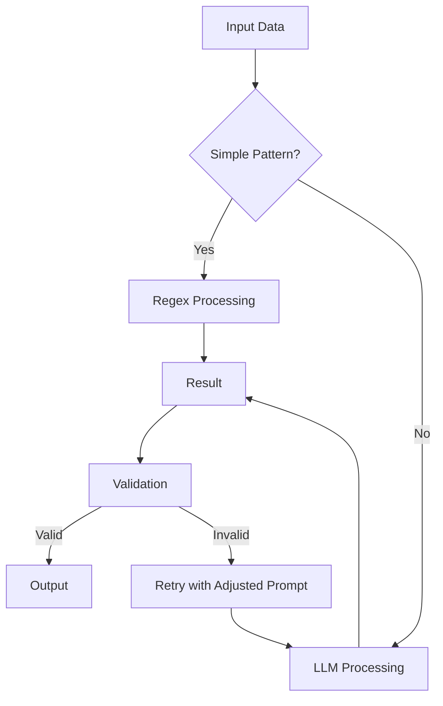
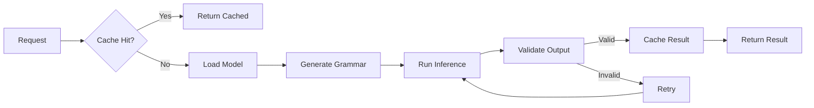
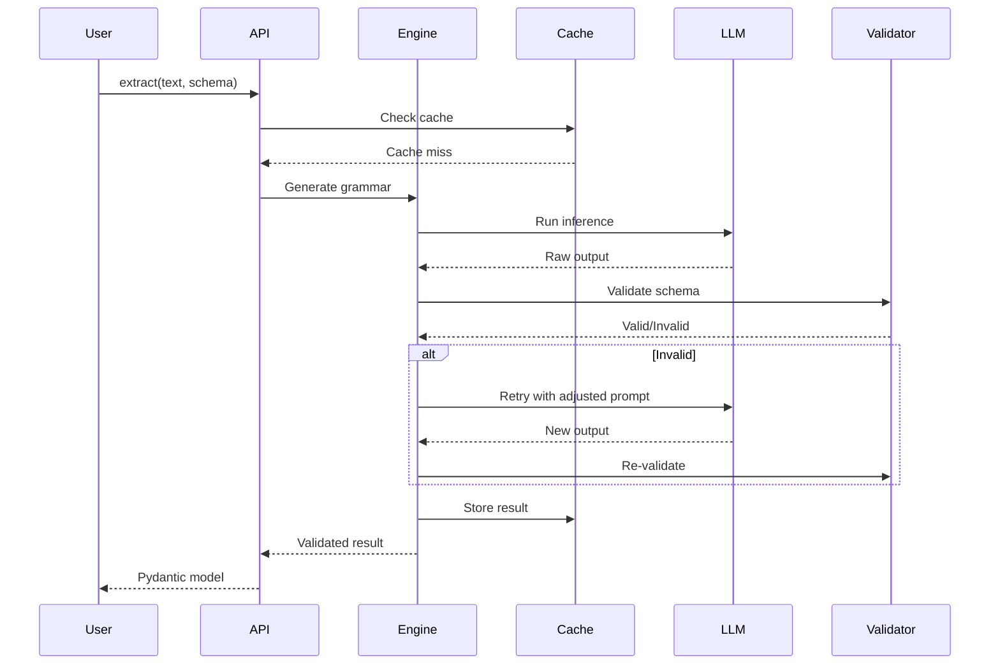
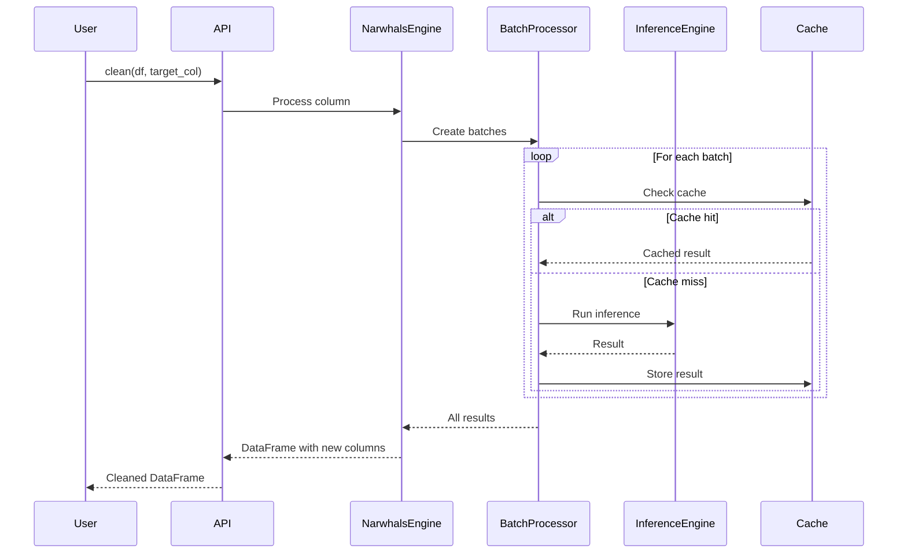

## Architecture Overview

Loclean is built on a hybrid architecture that combines the speed of regex with the intelligence of local LLMs, all while maintaining privacy and determinism.

## Core Components

### 1. Hybrid Router

Loclean uses a hybrid approach that intelligently routes between regex and LLM processing:



**Benefits:**
- Fast regex for simple patterns
- LLM for complex, ambiguous cases
- Automatic fallback and retry

### 2. GBNF Grammar Generation

Loclean automatically converts Pydantic schemas to GBNF (Grammar-Based Neural Format) grammars:

```python
from pydantic import BaseModel

class Product(BaseModel):
    name: str
    price: int
    color: str

# Loclean automatically generates GBNF grammar:
# - Forces LLM to output valid JSON
# - Ensures schema compliance
# - Prevents hallucinations
```

**How it works:**
1. Parse Pydantic schema
2. Convert to JSON Schema
3. Generate GBNF grammar rules
4. Constrain LLM output to valid structure

### 3. Inference Engine

The inference engine manages model loading, caching, and execution:



**Features:**
- Automatic model downloading
- Persistent result caching
- Retry logic with prompt adjustment
- Batch processing optimization

### 4. Backend Agnostic Design

Built on **Narwhals**, Loclean supports multiple DataFrame backends transparently:

```python
# Works with any Narwhals-compatible backend
import pandas as pd
import polars as pl

# Pandas
df_pd = pd.DataFrame({"data": ["5kg", "3kg"]})
result_pd = loclean.clean(df_pd, target_col="data")
# Returns: pandas.DataFrame

# Polars
df_pl = pl.DataFrame({"data": ["5kg", "3kg"]})
result_pl = loclean.clean(df_pl, target_col="data")
# Returns: polars.DataFrame
```

**Benefits:**
- Zero-copy operations
- Preserves lazy evaluation (Polars)
- No vendor lock-in
- Seamless backend switching

## Data Flow

### Extraction Flow



### Cleaning Flow



## Caching System

Loclean uses SQLite for persistent caching:

### Cache Key Generation

```python
# Cache key format: v3::{instruction}::{text_hash}
cache_key = f"v3::{instruction}::{sha256(text)}"
```

### Cache Benefits

- **Speed**: Instant results for repeated queries
- **Cost**: No redundant LLM calls
- **Consistency**: Same input = same output

### Cache Invalidation

Cache is automatically invalidated when:
- Model changes
- Instruction changes
- Schema changes

## Privacy & Security

### Local-First Design

- All processing happens locally
- No data sent to external APIs
- Models run on your machine
- Complete data sovereignty

### PII Scrubbing

Hybrid approach for PII detection:

1. **Regex patterns**: Fast detection of common formats
2. **LLM detection**: Contextual understanding
3. **Faker generation**: Realistic replacement values

## Performance Optimizations

### Batch Processing

- Groups similar inputs together
- Reduces model loading overhead
- Optimizes memory usage

### Parallel Processing

- Multi-threaded execution
- CPU-bound task parallelization
- Configurable worker count

### Lazy Evaluation

- Preserves Polars lazy evaluation
- Deferred computation
- Query optimization

## Error Handling

### Retry Logic

```python
# Automatic retry on validation failure
max_retries = 3
for attempt in range(max_retries):
    try:
        result = llm.generate(prompt)
        validated = schema.validate(result)
        return validated
    except ValidationError:
        prompt = adjust_prompt(prompt, error)
        continue
```

### JSON Repair

Automatic repair of malformed JSON:
- Fixes common syntax errors
- Handles incomplete outputs
- Recovers from truncation

## Design Principles

1. **Privacy First**: Everything runs locally
2. **Deterministic**: GBNF ensures valid output
3. **Backend Agnostic**: Works with any DataFrame library
4. **Performance**: Optimized for production use
5. **Type Safe**: Pydantic ensures type correctness

## Related Topics

- [Quick Start Guide](/loclean/getting-started/quick-start/) - Get started with Loclean
- [API Reference](/loclean/reference/api/) - Complete function documentation
- [Configuration](/loclean/reference/configuration/) - Engine and model configuration
- [Data Cleaning](/loclean/getting-started/data-cleaning/) - Data cleaning features
- [Structured Extraction](/loclean/guides/extraction/) - Extraction capabilities
- [Privacy Scrubbing](/loclean/guides/privacy/) - Privacy features
